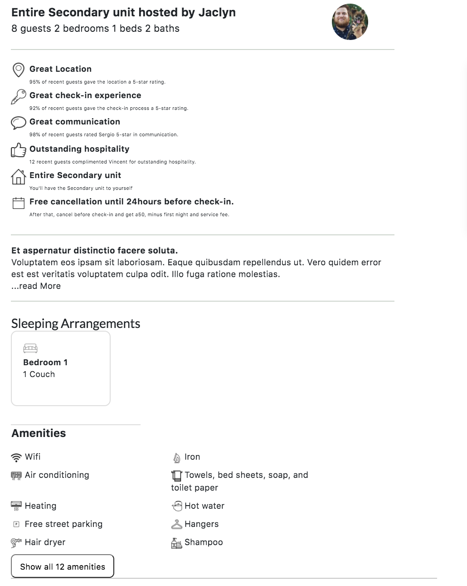
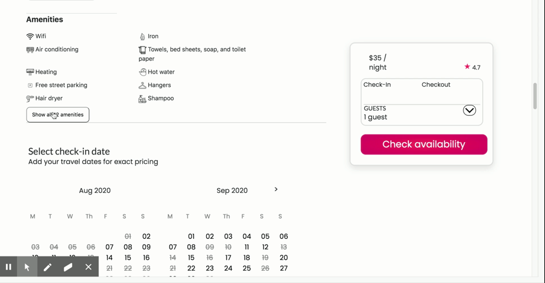

# Description Service

This service is composed of multiple components that provide a potential guests with relevant information about the listing including host information, amenities, a description etc.

> Below are some of the components that were a part of the Descriptions Service (all part of the Descriptions Service)
> <a href="url"></a>

## Components

> 

> 

> 

> 

## Related Projects

- https://github.com/Wilberg-Airbnb/reservation
- https://github.com/Wilberg-Airbnb/reviews
- https://github.com/Wilberg-Airbnb/location
- https://github.com/Wilberg-Airbnb/suggestion
- https://github.com/Wilberg-Airbnb/photos
- https://github.com/Wilberg-Airbnb/host

## Table of Contents

1. [Usage](#Usage)
1. [Requirements](#requirements)
1. [Development](#development)

## Usage

Some usage instructions:

> 1.  "npm install" to install all of the dependcies
> 2.  Running Webpack: "npm run react-dev",
> 3.  Seeding the database: "npm run seed"
> 4.  Running the Server: "npm run server"
> 5.  Port number: 4000
> 6.  Navigate to http://localhost:4000/${Listing between 0 - 99}/

## Requirements

An `nvmrc` file is included if using [nvm](https://github.com/creationix/nvm).

- Node 6.13.0
- etc

## Development

### Installing Dependencies

From within the root directory:

```sh
npm install -g webpack
npm install
```
